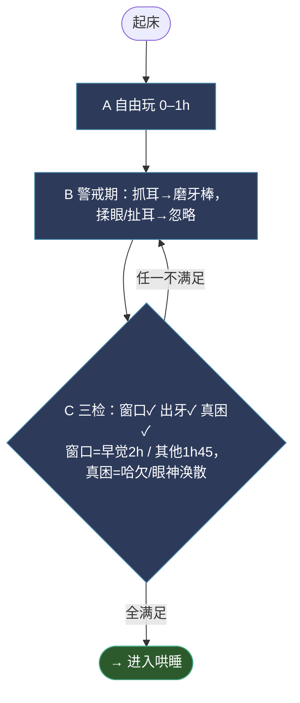

# 哄睡步骤（夜觉版）

> 哄睡前看一眼。基于 2026-05-20 自主入睡里程碑 + 2026-05-21、2026-05-23 复盘提炼。
> 核心咒语：**床垫优先，最小介入，软下就放。**

## 流程图

### ① 入场判断

### ② 哄睡执行

> 止损规则（B 方案）：床上 F 段、楼道 I 段**各 15 分钟独立计时**，总预算 ~30-40 分钟。
> 任一段 15 分钟内未出现任何软下信号 → 止损。

## 入场前三检（2026-05-23 加）

启动哄睡前先过这三关，不过关就**不哄**：

1. **清醒窗口 ≥ 1h45（早晨第一觉 ≥ 2h）**
   - 此前的揉眼/扯耳/烦躁一律按出牙或无聊处理，不启动哄睡
   - 起床时刻立刻记下
   - 5-23 上午第一觉印证：1h30 启动 → 23 分钟无效，多等 55 分钟（共 2h25）才真困

2. **出牙变量先释放**
   - 抓耳 / 耳朵泛红 / 烦躁 → 先给冷磨牙棒 5-10 分钟
   - 啃完情绪稳 + 出现真困信号 → 是困，启动
   - 啃完反而想玩 → 之前是出牙伪装，让他玩

3. **真困 vs 假困**
   - 假困（不哄）：揉眼、扯耳、烦躁哭、爬人身上求抱
   - 真困（启动）：**打哈欠**、动作变慢、趴着不动盯一个点、对玩具无反应、玩的质量下降（主动→被动）、不愿撑起（爬期娃）
   - 真困抗睡（已困但卡住）：**额头主动埋肩头 + 背拱起来**（5-23 夜觉印证，这是临门一脚的姿势）
   - **眼神涣散对本娃不可靠**（高觉察型，几乎全天在线），别依赖
   - **哈欠是必要不充分**（5-23 印证）：哈欠出现 ≠ 能顺利入睡，娃可能哈欠后仍持续抗睡 30+ 分钟
   - 5-23 上午第一觉：3 次哈欠是事后回看最准的信号

## 三态诊断：不困 / 真困抗睡 / 困过头型抗睡（2026-05-23 加）

当哈欠等"困意信号"和"抗拒信号"同时出现时，必须先分清三态，处理完全不同。

| 维度 | 不困 | 真困抗睡 | 困过头型抗睡 |
|---|---|---|---|
| 情绪基线 | 清亮开心 | 烦躁但可被节奏带 | 兴奋 + 不耐烦 + 焦虑 |
| 对视反应 | 主动笑、咯咯笑 | 偶尔被动看，难笑 | **可能仍能笑**（应激下大脑高活跃） |
| 哈欠 | 没有 | 多次（如 2-4 次） | 少或晚出现 |
| 玩耍意愿 | 主动伸手、找新玩具 | 想玩但持续力下降 | 尖叫、急促呼吸、坐不住 |
| 想转前抱 | 不一定 | **典型**（抗 sleep onset） | 不一定，更倾向乱动 |
| 户外效果 | 不会睡（强化清醒） | 通常能带睡 | **未必快速见效**，需先卸压 |
| 根因 | 时间没到/能量没耗 | 高觉察娃正面对抗困意 | 睡眠债太重 → 皮质醇上行 |

### 处理策略

**不困**：
- 推迟启动，回阶段 A/B 让他玩
- 不要在"睡眠环境"（暗屋/床/抱）里耗，加重错位

**真困抗睡**：
- 出门走（户外是兜底之王，5-21 + 5-23 三次验证）
- 接受"半抱睡"，不强求自主入睡
- 节奏感安抚 + 单调视野（参考"想转前抱"应对策略）

**困过头型抗睡**：
- **先卸压再哄**：撤掉睡觉环境暗示（留点亮光、离开床、放地自由活动）
- 让他**主动消耗** 15-30 分钟（爬、玩，不抱）
- 等"玩的质量下降 + 哈欠"再启动 → 走"真困抗睡"路径
- 接受夜觉/午觉**整体推迟 30-60 分钟**，比硬哄崩溃健康
- 经典剧本：5-21 下午（短觉接觉失败 → 困过头 → 室内全失败 → 户外救援）；5-23 夜觉 18:43 启动失败

### 关键鉴别问题

启动前问自己一遍：
1. 他**对视会笑**吗？会 → 不困 或 困过头（看其他信号）
2. **强度有没有下降**？没下降 → 不困；下降但仍兴奋 → 困过头；下降且趋静 → 真困
3. **能被节奏带住**吗？能 → 真困；带不住越带越兴奋 → 困过头

## 五步流程

1. **关灯 → 直接放床垫**
   - 不预热抱、不仪式抱
   - 妈妈在场（关键变量）

2. **床上蛄蛹 15–20 分钟**
   - 让他自由翻、撑、揉眉毛
   - 爸爸床边轻拍 / 轻推屁股
   - 超时或真哭才进下一步

3. **哭 → 抱起 = 短暂安抚（不是哄睡）**
   - 不要长程溜达、不要走廊+暗屋+客厅串场
   - 安静下来就准备放

4. **软下来 = 立刻放回床垫**（精确定义见下方独立小节）
   - "身体变软"是放下窗口，**不是**等睡着的信号
   - 在肩上睡着再放 = 抱睡退步

5. **放下后用"推屁股"桥接**
   - 不晃、不走、不哼歌升级
   - 蛄蛹再起 → 再推屁股，循环到稳定

## "软下来"精确定义（2026-05-23 加）

必须**同时**满足两条才算软下：

1. **肌肉张力下降**：胳膊腿不主动撑，头/脖子主动搭/靠
2. **注意力从外部收回**：不再主动看东西，眼神涣散

| 信号                       | 状态              | 动作          |
| ------------------------ | --------------- | ----------- |
| 胳膊软 + 还在看（探头、侧搭看、抬脖看斜上方） | 探索安静态（**不是软下**） | 继续抱 + 节奏感，等 |
| **不再主动看了 / 眼神涣散**        | **早期软下（窗口开门）**  | 放下 + 推屁股/拍  |
| 头主动搭肩、呼吸变慢               | 中期软下            | 立刻放，别等      |
| 身体塌一下 / 微抽动              | 浅睡边缘（窗口快关）      | 赶紧放（半抱睡线）   |

口诀：**"不再看" = 开门，"塌一下" = 关门**

## 15 分钟止损（B 方案：分段独立计时）

- **床上 F 段**：15 分钟内未出现任何软下信号 → 止损
- **楼道 I 段**：15 分钟内未出现任何软下信号 → 止损
- 中间的抱起短安抚 G 不单独计时（短，几分钟内必须决定放或继续）
- 总预算 ~30-40 分钟，超出基本可判**当次非真困**，回自由玩
- 5-23 上午第一觉因没止损浪费了 23 分钟（应在床上 F 段 15 分钟到点止损）

## 三条红线（违反就是退步）

- ❌ 等娃在肩上睡着再放
- ❌ 抱起后长程溜达 / 晃睡 *（仅指未真困阶段；真困窗口内允许楼道短距走 + 拍屁股 + 嗯嗯，见 5-23）*
- ❌ 直接降级感官（白噪音/暗屋）在娃还没消耗完之前

## 夜醒处理

- 先**观察 2–3 分钟**，不立刻换尿布
- 独立尝试上限 **15–20 分钟**
- 超时切到："抱起短暂安抚 → 放下 + 推屁股"
- 控制同床传热，必要时拉开距离
