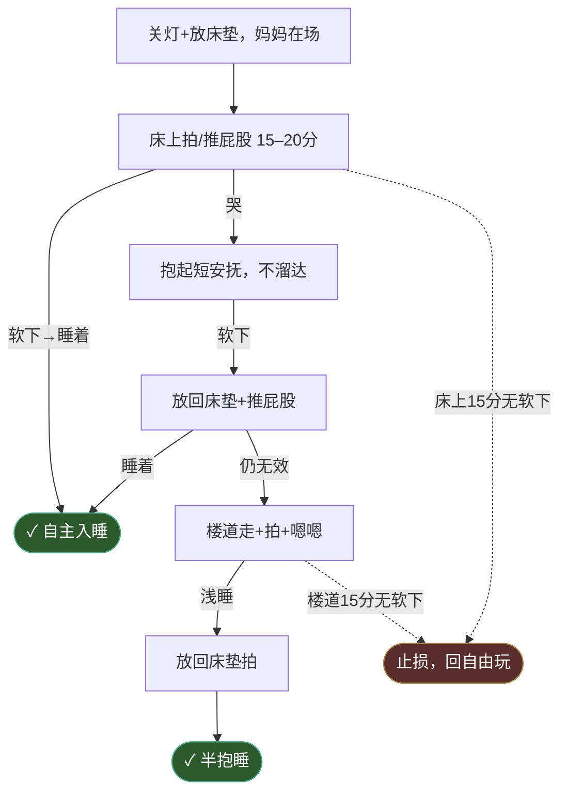

# 哄睡步骤（夜觉版）

> 哄睡前看一眼。
> 核心：**床垫优先，最小介入，软下就放。**

## 流程图

### ① 入场判断


### ② 哄睡执行

> 止损：床上 F、楼道 I **各 15 分钟独立计时**，总预算 30-40 分钟。任一段 15 分钟无软下信号 → 止损。



## 入场前三检

不过关就**不哄**。

1. **清醒窗口 ≥ 1h45（早觉 ≥ 2h）**
   - 此前的揉眼/扯耳一律按出牙或无聊处理
   - 起床时刻立刻记下
   - 5-23 印证：1h30 启动 → 23 分钟无效，多等 55 分钟（共 2h25）才真困

2. **出牙先释放**
   - 抓耳 / 耳红 / 烦躁 → 冷磨牙棒 5-10 分钟
   - 啃完情绪稳 + 真困信号 → 启动
   - 啃完想玩 → 之前是出牙伪装，让玩

3. **真困 vs 假困**
   - 假困（不哄）：揉眼、扯耳、烦躁哭、爬人身上求抱
   - 真困（启动）：**打哈欠**、动作变慢、趴着盯一点、对玩具无反应、玩的质量下降（主动→被动）、不愿撑起（爬期）
   - 真困抗睡卡住：**「头/脸主动找妈妈身体」信号家族**（5 月龄稳定复现 4 次，正式入卡）
     - 5-23 额头埋肩 + 背拱起
     - 5-24 额头顶肩
     - 5-25 肩头擦眼睛
     - 5-27 脸埋脖子不动
     - 共性：头/脸主动接触 → 立刻放下 / 软下放回，是最强 sleep onset 信号
   - **眼神涣散对本娃不可靠**（高觉察，几乎全天在线）
   - **哈欠必要不充分**：哈欠 ≠ 顺利入睡，可能哈欠后仍抗睡 30+ 分钟
   - 5-23 上午：3 次哈欠事后回看最准

## 三态诊断：不困 / 真困抗睡 / 困过头型抗睡

困意信号 + 抗拒信号同时出现时必须分清，处理完全不同。

| 维度 | 不困 | 真困抗睡 | 困过头型抗睡 |
|---|---|---|---|
| 情绪基线 | 清亮开心 | 烦躁但可被节奏带 | 兴奋 + 不耐烦 + 焦虑 |
| 对视反应 | 主动笑、咯咯笑 | 偶尔被动看，难笑 | **可能仍能笑**（应激下大脑高活跃） |
| 哈欠 | 无 | 多次（2-4 次） | 少或晚 |
| 玩耍意愿 | 主动伸手、找新玩具 | 想玩但持续力下降 | 尖叫、急促呼吸、坐不住 |
| 想转前抱 | 不一定 | **典型**（抗 sleep onset） | 不一定，更倾向乱动 |
| 户外效果 | 不会睡（强化清醒） | 通常能带睡 | **未必快**，需先卸压 |
| 根因 | 时间没到/能量没耗 | 高觉察娃正面对抗困意 | 睡眠债重 → 皮质醇上行 |

### 处理策略

**不困**：推迟启动，回 A/B 让他玩。不要在睡眠环境里耗。

**真困抗睡**：出门走（户外是兜底之王，5-21 + 5-23 三次验证）。接受半抱睡。节奏感安抚 + 单调视野。

**困过头型抗睡**：
- **先卸压再哄**：撤睡眠环境暗示（留亮光、离床、放地活动）
- 让他**主动消耗** 15-30 分钟（爬、玩，不抱）
- 等"玩的质量下降 + 哈欠"再启动 → 走真困抗睡路径
- 接受整体推迟 30-60 分钟，比硬哄崩溃健康
- 经典剧本：5-21 下午（短觉接觉失败 → 困过头 → 室内全失败 → 户外救援）；5-23 夜觉 18:43 失败

### 鉴别问题

1. **对视会笑**吗？会 → 不困 或 困过头
2. **强度有没有下降**？没下降 → 不困；下降但仍兴奋 → 困过头；下降且趋静 → 真困
3. **能被节奏带住**吗？能 → 真困；越带越兴奋 → 困过头

## 五步流程

1. **关灯 → 直接放床垫**
   - 不预热抱、不仪式抱
   - 妈妈在场（关键变量）

2. **床上蛄蛹 15–20 分钟**
   - 自由翻、撑、揉眉
   - 爸爸床边轻拍 / 轻推屁股
   - 超时或真哭才进下一步

3. **哭 → 抱起 = 短暂安抚**（不是哄睡）
   - 不长程溜达、不串场
   - 安静就准备放

4. **软下来 = 立刻放回床垫**（定义见下）
   - "身体变软" = 放下窗口，**不是**等睡着的信号
   - 在肩上睡着再放 = 抱睡退步

5. **放下后用"推屁股"桥接**
   - 不晃、不走、不哼歌升级
   - 蛄蛹再起 → 再推屁股，循环到稳定

## "软下来"精确定义

**同时**满足两条：

1. **肌张力下降**：胳膊腿不主动撑，头/脖子主动搭
2. **注意力收回**：不再主动看，眼神涣散

| 信号 | 状态 | 动作 |
|---|---|---|
| 胳膊软 + 还在看（探头、侧搭看、抬脖看斜上方） | 探索安静态（**不是软下**） | 继续抱 + 节奏感，等 |
| **不再主动看 / 眼神涣散** | **早期软下（窗口开门）** | 放下 + 推屁股/拍 |
| 头主动搭肩、呼吸变慢 | 中期软下 | 立刻放 |
| 身体塌一下 / 微抽动 | 浅睡边缘（窗口快关） | 赶紧放（半抱睡线） |

口诀：**"不再看" = 开门，"塌一下" = 关门**

## 15 分钟止损（分段独立计时）

- **床上 F 段**：15 分钟无软下 → 止损
- **楼道 I 段**：15 分钟无软下 → 止损
- 中间抱起短安抚 G 不单独计时（短，几分钟内决定放或继续）
- 总预算 30-40 分钟，超出判**非真困**，回自由玩
- 5-23 上午没止损浪费 23 分钟

## 三条红线

- ❌ 等娃在肩上睡着再放
- ❌ 抱起后长程溜达 / 晃睡 *（仅指未真困阶段；真困窗口内允许楼道短距走 + 拍屁股 + 嗯嗯）*
- ❌ 在娃没消耗完之前直接降级感官（白噪音/暗屋）

## 夜醒处理

- 先**观察 2-3 分钟**，不立刻换尿布
- 独立尝试上限 **15-20 分钟**
- 超时切到"抱起短暂安抚 → 放下 + 推屁股"
- 控制同床传热，必要时拉开距离

## 接觉 SOP（5-26 验证）

> 短觉醒后**主动接觉**，黄金窗口 5-15min 内。

### 触发条件（满足任一）

- 35-50min 短觉醒
- **眯眯眼态 / 浅睡边缘**（非完全清醒，不哭闹）

### 标准流程（床上优先）

```
第 1 步（床上拍 10-15min）：
- 立刻进房，不开灯
- 白噪音保持 / 油烟机继续开
- **不抱起**，床边坐下拍屁股
- 嗯嗯嗯节奏

判定：
A. 头变重 + 5min 不动 = ✅ 床上接觉成功（最理想）
B. 拍 10-15min 哭闹升级 → 进入第 2 步

第 2 步（抱起短安抚 + 严格放下）：
- 抱起，等额头顶肩 / 肩头擦眼睛 / 眼神涣散
- 软下来立刻放回床垫继续拍
- **关键：不在怀里睡着，要在床上睡着**

判定：
A. 放下 5min 内睡着 = ✅ 半抱睡接觉成功
B. 放下哭 → 再抱 → 再放，循环 ≤ 2 次
C. 第 3 次放下仍哭 = 接觉失败，撤

止损：总操作 15-20min 仍无效 → 放弃，接受短觉
```

### 红线

- ❌ 跳过第 1 步直接抱起 → 怀里睡 → 放下必醒（5-26 中觉教训）
- ❌ 接到怀里睡着就当成功 → 抱睡边缘态，下次更难放下
- ❌ 死磕超 20min → 强化"床=不舒服"印象

## 兴奋状态处理（5-26 验证，与困过头三态平行）

> 哄睡中"啊噗啊噗说话 + 不睡 + 不闹" = 兴奋档，处理同困过头：撤暗示。

### 鉴别

| 状态 | 表现 | 处理 |
|---|---|---|
| 真困抗睡 | 烦躁可被节奏带 | 竖抱锁定 / 出门 |
| 困过头 | 兴奋 + 焦虑 + 哭闹 | 撤暗示 + 自主消耗 |
| **兴奋（新增）** | **说话兴奋，不哭闹** | **放下让自己玩** |

### 操作

- 放回床垫 / 爬爬垫
- 不抱、不拍、不互动主导
- 让娃自己消耗 5-15min
- 等"突然安静 / 蛄蛹找姿势" → 自主入睡
- 5-26 夜觉案例：19:50 放下让自己玩 → 19:55 自己睡着

## 顶肩信号叠加规则（5-26 验证）

- **单次顶肩** = 弱信号（5-23/5-24/5-25 单次成功过，但 5-26 午觉单次失败）
- **顶肩 ×2 / 顶肩 + 肩头擦眼睛 + 眼神涣散** = 强信号
- 反流敏感 / 状态扰动期：信号需要叠加确认才放下

## 安全睡眠红线（AAP / FDA 标准）

### 婴儿床内禁用物品

- ❌ 任何枕头（含荞麦 / 豆豆 / 大人枕）
- ❌ 毛绒玩具
- ❌ 厚被 / 毯子（用睡袋替代）
- ❌ 倾斜垫 / 楔形垫
- ❌ Boppy / Rock 'n Play 类产品（已被 FDA 召回，多例窒息死亡）

### 睡姿安全

- ❌ 角度 > 10 度的"半坐" / "抬高"姿势
- ❌ 头部陷入软物（枕头 / 沙发缝 / 大人床缝）
- ❌ 上半身趴枕 + 下半身平躺（颈椎过度弯曲 + 窒息风险）

### 正确做法

- ✅ 平面婴儿床 + 硬床垫
- ✅ 仰睡放下（会翻身后允许自主翻）
- ✅ 无任何额外物品
- ✅ 室温 18-22°C，睡袋替代被子
- ✅ 反流期想抬高 → 抬床垫整端 ≤ 10 度（不在娃身下垫东西）

### 发现不安全姿势

- ✅ 立刻挪回床垫平面 + 移除危险物
- ✅ 短暂醒可接受
- ❌ "他自己找的姿势他喜欢"不是借口（5 月龄无法判断安全）
- ❌ "习惯了就好"不是借口（窒息是物理安全，不是习惯问题）

### 5-26 教训

- 夜觉自主入睡时找到「上半身趴荞麦枕，下半身斜床垫」姿势
- 归因：反流不适 → 本能寻找竖直姿势
- 处理：移到平面 + 永久移除床内枕头
